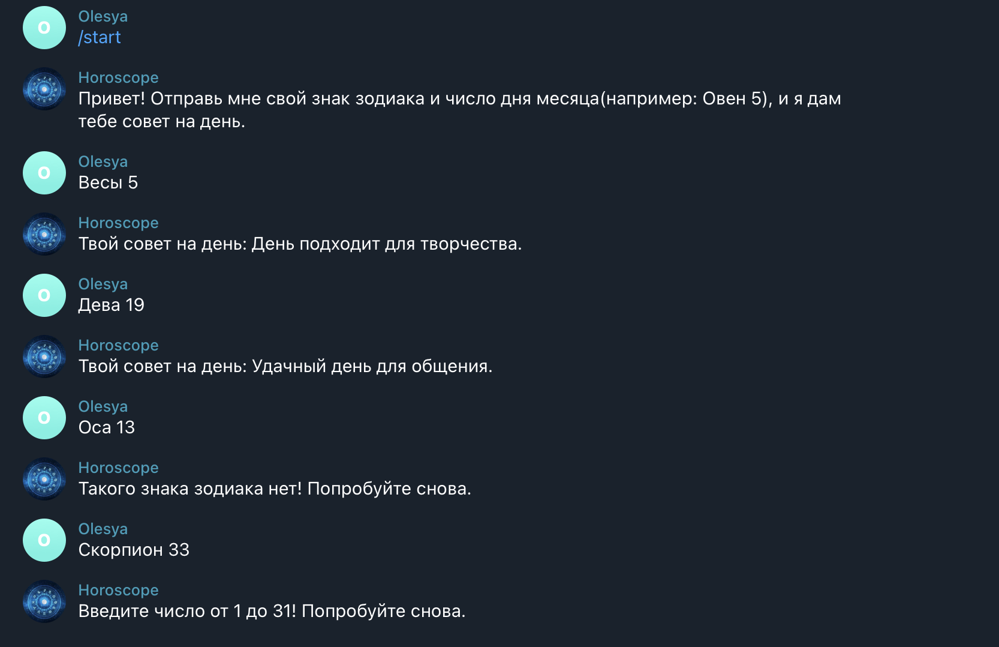
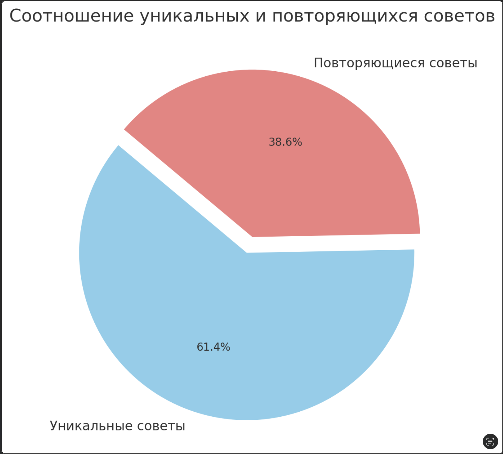

# Telegram Бот-Гороскоп  

Это бот в Telegram, который выдает советы на день, основываясь на знаке зодиака и числе дня месяца.  

## Как запустить?  

### 1. Установите зависимости  
Убедитесь, что у вас установлен Python (версии 3.8+). Затем установите необходимые библиотеки:  

```bash
pip install python-telegram-bot
```

### 2. Укажите токен бота  
В файле `main.py` замените `TOKEN` на свой токен, полученный от [@BotFather](https://t.me/BotFather).

### 4. Запустите бота  
Выполните команду:  

```bash
python main.py
```

Если все настроено правильно, в терминале появится сообщение:  

```
Бот запущен...
```

## Как пользоваться  
1. Напишите `/start`, чтобы получить приветственное сообщение.  
2. Отправьте свой знак зодиака и число дня месяца (например: `Овен 5`).  
3. Бот отправит вам совет.

  

## Используемые технологии  
- Python  
- `python-telegram-bot`  
- JSON (для хранения гороскопов)  

## График

